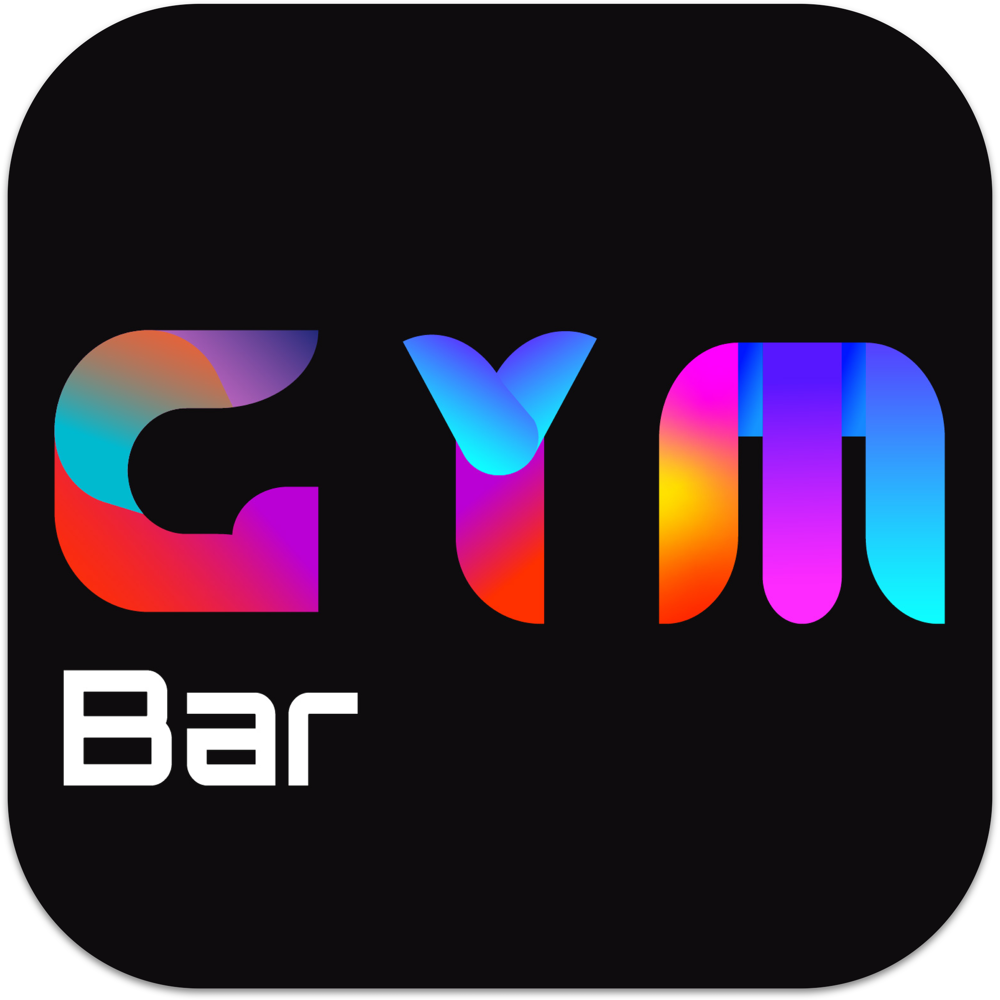
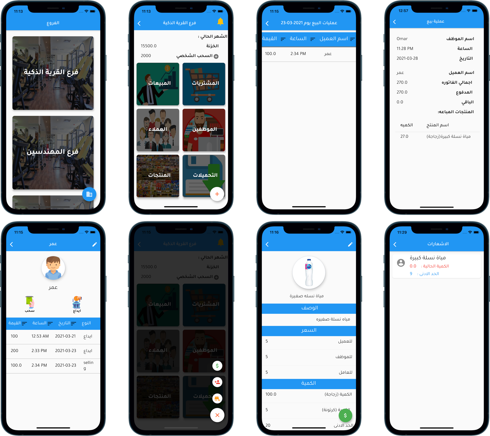
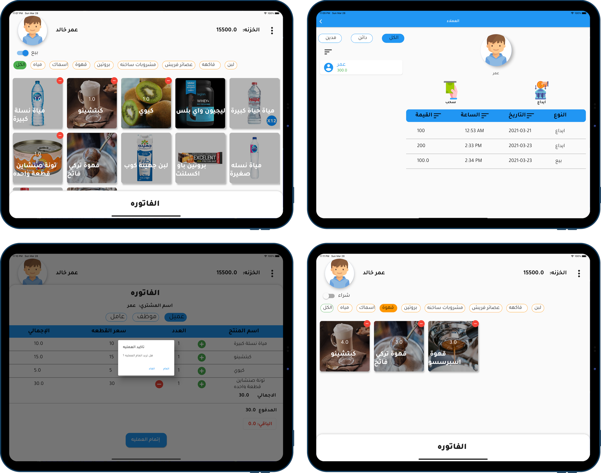

  

<h1 align="center">GYM BAR</h1>

<h2 align="left">ℹ️ About</h2>

This documentation describes the specifications and usage of the GYMBAR, GYMBAR SALES app. These two applications are used to manage the partitions that provide food for the exercisers in each gym branch.

## ❗️ Problem
There are partitions in each of the gymnasiums to sell the food items for the exercisers and guests, and the owner of these partitions finds it difficult to manage each of them, as each branch contains different customers, and there are many branches and then many partitions, so it became difficult to manage all these partitions together using the old traditional methods.

## 💡 My Proposal
Building a program to solve the management problem, the program can manage each branch separately and show results on a daily and organized basis, It is divided into two applications and a Tablet/iPad app for selling and an iPhone/Android app for the managers to follow the buying and selling processes and follow the progress.

## 📷🖥 screenshots iPhone/Android App

## 📷🖥 screenshots iPad/Web App

## ⭐️ Features

The seller who uses the iPad, Tablet, and Web version of the app can:

1. Sell and buy multiple products.

2. add the change of the bill to the Employee’s wallet

3. pay the remaining bill from the employee’s credit in his wallet

4. withdraw and deposit money to and from the employee’s wallet.

   

The Manager who use the iPhone and Android version of the app can:

1. view all transactions made on a specific date with their details.
2. create accounts for employees and sellers.
3. create new categories and products.
4. buy existing product quantity.
5. The manager is notified of the products that are about to run out of stock.
6. the owner can make a personal withdrawal from the branch capital.
7. create new branches.

## 📦 Packages used.

- all Firebase packages.
- http_parser
- provider
- cupertino_icons
- image_picker
- cached_network_image
- transparent_image
- sliding_up_panel
- search_widget

Reference: https://pub.dev.

## 🤝 Contributors.

Ali Hassan was the UI/UX designer who made all the portfolios of the two apps using inVision Studio.

## 👨🏽‍💻 Who Am I.

I am Omar Khaled, I am a front-end mobile developer and I developed this app using the Flutter framework from Google.
